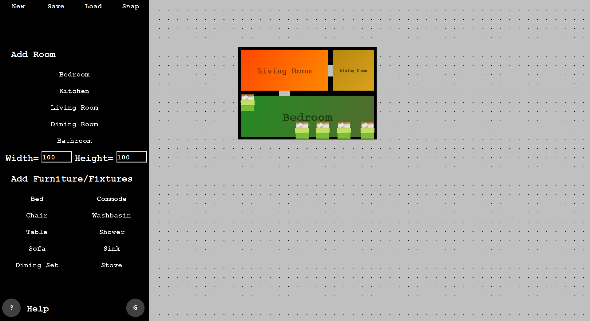

# 🏗️ 2D Floor Planner – OOPs Project

## 📌 Overview
The **2D Floor Planner** is a Java Swing-based desktop app for creating simple 2D home layouts. Users can place rooms, doors, windows, and furniture using a drag-and-drop interface. It includes snapping, saving/loading, and overlap validation.

---

## ✨ Features

### 🏠 Room Creation
- Add rooms with preset sizes and colors:
  - **Bedroom**: Green  
  - **Bathroom**: Blue  
  - **Kitchen**: Red  
  - **Living/Dining**: Yellow/Orange  
  - **Walls**: Black  
  - **Outside**: Light Gray
- Rooms are placed in **row-wise order** (like scanning lines).
- **No overlapping** allowed.

### 🧭 Advanced Placement
- Place rooms **relative to other rooms**:
  - Directions: North, South, East, West  
  - Alignment: Center, Left, Right / Top, Middle, Bottom
- Auto overlap checks while placing.

### 🗑️ Deletion
- Right-click to delete rooms.
- Or drag to the **trash area** (enabled by clicking the **'G'** button).

### ✏️ Editing
- **Drag rooms** to reposition.
- If invalid placement, it auto-returns.
- **Save/Load** floor plans to/from files.
- Snap to **grid or wall** for precise alignment.

### 🚪 Doors, 🪟 Windows, and 🛋️ Furniture
- **Doors**:
  - Only between rooms (no door to outside from bedrooms/bathrooms).
  - Open kitchens can have wide doorways.
- **Windows**:
  - Shown as dashed lines.
  - Only between a room and the outside.
- **Furniture** (e.g. Bed, Chair, Table, Sofa, Stove, Sink, etc.):
  - PNG images from `lib/lib/` folder.
  - Can rotate by right-clicking.
  - No overlapping with other elements.

---

## 🖼️ User Interface

### 🔧 Left Panel (25%)
- **Toolbar**: Save & Load buttons.
- **Room/Furniture Selection**: Pick type and size to add.
- **'G' Button**: Enables trash mode.

### 📐 Canvas Area (75%)
- Draw and edit your floor plan.
- Snap to grid for neat layout.
- **Trash area** at top-right corner.

![UI]

---

## ⚙️ How to Use

### 📥 Installation
1. Install **Java 8 or higher**.
2. Clone the repo:
   ```bash
   git clone https://github.com/Sasanka007922/2D-Floor-Planner.git
